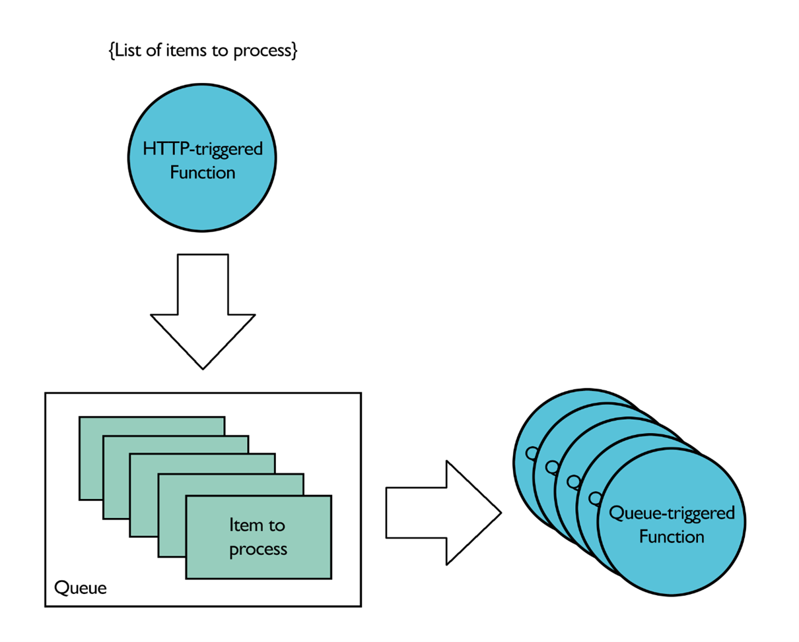
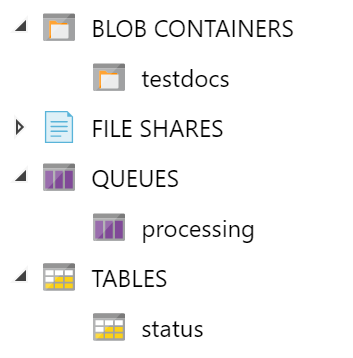

# Azure Python Functions - Queue triggered sample code

This repo contains sample code for an Azure Python Function App with an HTTP-triggered and a queue-triggered function.

## Scenario



The HTTP-triggered function, *TriggerProcessing*, is meant to be called whenever you want to start the whole process. The sole purpose of this function is to put messages into a queue, and there will be one message per item to process. Each item will then be picked up and processed by the queue-triggered function, *ProcessDoc*, and the status of each item is displayed in a table.

In this sample code, *TriggerProcessing* takes a list of text documents from blob storage as input, and *ProcessDoc* processes these documents to reverse the text before saving the updated version.

## How to use

* Create an Azure Storage account 
* Create a blob container *testdocs*, a table *status* and a queue *processing* in this storage account

* Upload the files in the *sample_files* folder in your blob container
* Download or clone this repository
* Make sure you have [the right environment](https://docs.microsoft.com/en-us/azure/azure-functions/create-first-function-cli-python) to run Azure Python Functions 
* Create a local.settings.json file containing the following:
```json
{
  "IsEncrypted": false,
  "Values": {
    "FUNCTIONS_WORKER_RUNTIME": "python",
    "AzureWebJobsStorage": "UseDevelopmentStorage=true",
    "QueueConnectionString": "<STORAGE_CONNECTION_STRING>",
    "STORAGE_CONTAINER_NAME": "testdocs",
    "STORAGE_TABLE_NAME": "status"
  }
}
```
* Run the function app: `func host start`
* Test it by sending a POST request to http://localhost:7071/api/TriggerProcessing
```
curl --location --request POST 'http://localhost:7071/api/TriggerProcessing' \
--header 'Content-Type: text/plain' \
--data-raw '{
    "documentList": ["sample_file1.txt", "sample_file2.txt", "sample_file3.txt", "sample_file4.txt", "sample_file5.txt"]
}'
```

You should have newly created files in your blob container, as well as new entities in the status table. If everything worked properly, you should see the list of files processed with the status "done".


